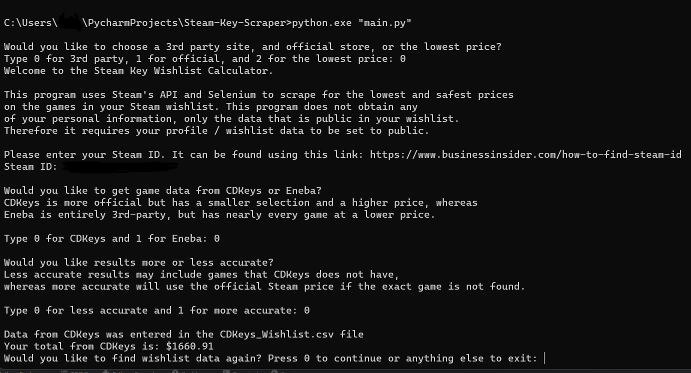
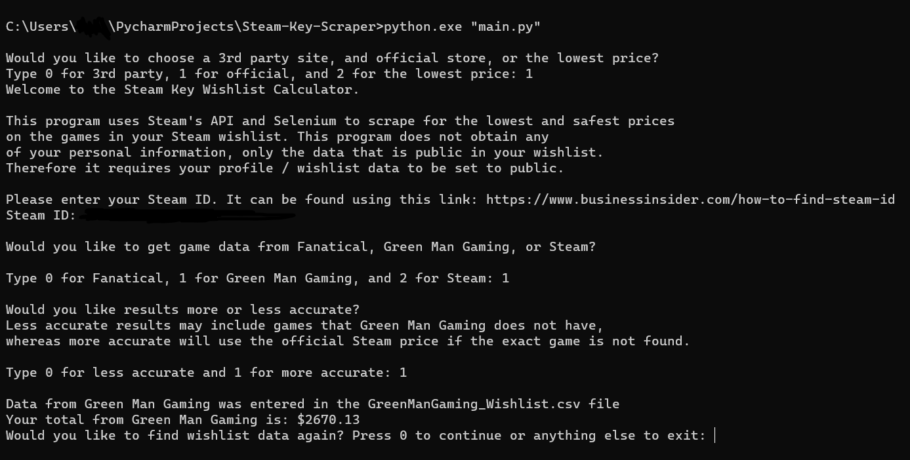
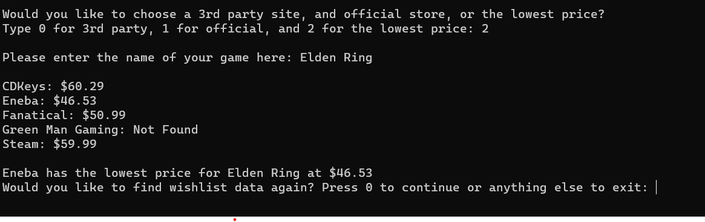

# Steam-Wishlist-Scraper

The Steam Wishlist Scraper is a Python webscraping script that uses Selenium and Edgedriver to scrape dynamic content from store's search results and can be configured to choose between a higher accuracy and lower accuracy mode. Users will require MS Edge Chromium (preinstalled with Windows). 

The higher accuracy mode only uses the web results if the name of the game in your wishlist on Steam is a valid substring within the top result in the store.
The lower accuracy mode prefers the top search result and will only use Steam as a fallback in case no result was found. 

When the script has finished scraping data, it will automatically enter the prices of all of the games in your wishlist into a "{store}_Wishlist.csv" file so you can easily organize it along with relevant data. 

There is also a cheapest game price finder if you would like to search for any game and find the lowest price among the five most reliable unofficial and official stores. 

The Steam Wishlist Scraper scrapes data from:
- <a href="https://www.cdkeys.com/">CDKeys</a> as they are the most reliable unofficial store.
- <a href="https://www.eneba.com/us/">Eneba</a> as they have the largest selection of games and lowest prices but is entirely a 3rd-party marketplace.
- <a href="https://www.fanatical.com/en/">Fanatical</a> as they have an excellent trustpilot rating and are more US-centric.
- <a href="https://www.greenmangaming.com/">Green Man Gaming</a> as they are also reliable and often have better sale prices than Fanatical.
- <a href="https://store.steampowered.com/">Steam</a> if you would like to know the total cost of your wishlist from the platform itself.

## Requirements
- Python
- Pip
- Selenium
- Edgedriver

## Usage
- Download the repo .zip file.
- Unzip the repo .zip using your favorite file archive tool.
- Run the main.exe file inside the /dist/main/ folder.

## Screenshots

